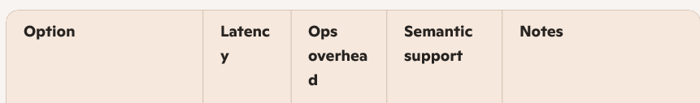
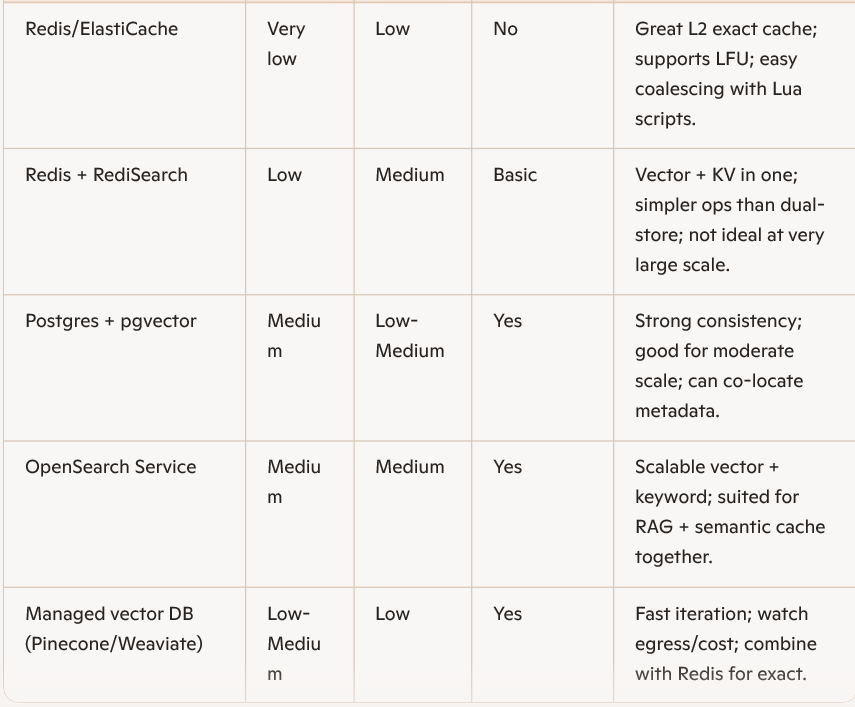

# Operations, metrics, and rollout
Metrics and SLOs
- Hit ratios: Overall, by tier (L1/L2/semantic), by intent/domain/tenant.
- Latency: P50/P95/P99 end-to-end; cache service P95 ≤ 10 ms (L2).
- Cost avoided: Tokens saved, calls saved, effective $/request reduction.
- Quality: Post-serve thumbs-up rate; semantic-distance vs. complaint rate; rollback triggers.
- Staleness: Fraction served stale; mean staleness time; invalidation lag.
Best practices
- Cold-start prewarming: Seed caches for top intents/queries after deployment or corpus updates.
- Eviction policy: Use LFU with aging for Redis; segment keys by class and reserve space per class to avoid cache stampede of one class evicting others.
- Backpressure: When LLM quota/latency spikes, broaden stale-while-revalidate windows for low-risk classes; degrade gracefully.
- A/B and shadowing: Compare cascades and thresholds; log-only shadow of semantic decisions before enabling serve.
- Regional locality: Keep semantic indices regional; don’t cross-region for P95; replicate embeddings asynchronously.

Rollout plan
- Phase 1: Exact cache + tool cache + request coalescing.
- Phase 2: Parametric cache with prompt templates and slot bounds.
- Phase 3: Semantic cache read-only shadow; measure; then enable with τ_high only.
- Phase 4: Stale-while-revalidate and background refresh for low-volatility domains.
- Phase 5: Multi-region replication, tenant-aware tuning, advanced admission policies.

Store choices and trade-offs

