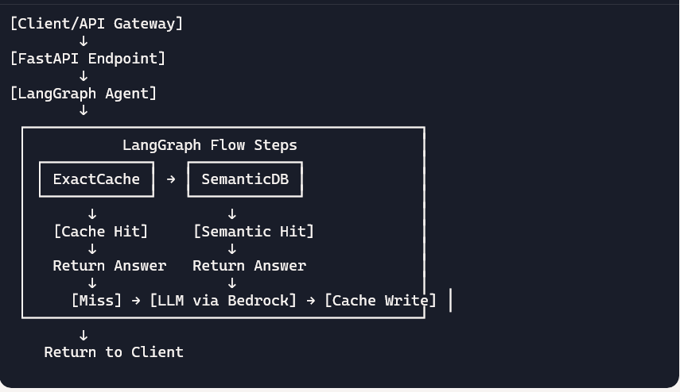

# MVP architecture overview

##	Core goal: Serve cached responses for repeat/near-duplicate prompts to cut latency and LLM cost while preserving correctness.

##	Scope reduction: Single-region, single-tenant; only two cache tiers and one semantic store.

## 	Component choices:
• 	API service: Python FastAPI or ASP.NET Core Minimal API.
• 	L1/L2 cache: Redis (local dev via Docker; prod via ElastiCache).
• 	Semantic store: PostgreSQL with pgvector or CockroachDB for embeddings and ANN search.
• 	Embedding + LLM: Pluggable providers (e.g., Azure OpenAI/OpenAI/Bedrock) behind clean interfaces.

## Cache design and policies
Cache tiers
- Exact cache: Redis KV. Keyed on normalized prompt context. Short-to-medium TTL.
- Semantic cache: pgvector table storing query embeddings, normalized prompts, answer, and metadata. Cosine similarity search with threshold gate.

Agentic orchestrator
- Decisioning: Exact → semantic ≥ τ_high → regenerate → (optional) serve-stale-and-refresh for low-volatility classes.
- Admission control: Cache only safe, non-PII answers with a minimum quality score or explicit allowlist of tasks.

Keys and normalization
- Key components: hash(system + developer + user prompt) + model_id + params + locale + persona + retrieval_etags[].
- Normalization: trim, lowercase where safe, canonicalize whitespace, sort JSON fields, strip timestamps/IDs, clamp temperature to buckets (e.g., 0.0, 0.2, 0.7)

TTL strategy
- Static/how-to: 1–24 hours.
- RAG/doc-based: TTL tied to corpus_etag; invalidate on publish.
- Time-sensitive: 0–5 minutes or bypass cache; include date in key to avoid stale reuse.

Concurrency and resilience
- Request coalescing: Single-flight per cache key via keyed locks or semaphores.
- Negative caching: Briefly cache “no answer/404” to prevent stampedes (TTL 15–60 seconds).
- Stale-while-revalidate (optional): Serve within soft TTL instantly and refresh in background.

## Request flow
1. Normalize request
- Inputs: system/developer messages, user prompt, model/params, persona, locale, corpus_etags.
- Outputs: canonicalized context and deterministic exact cache key.
2. Check exact cache in Redis
- Hit: If fresh and compatible, return immediately.
3. Semantic lookup in pgvector
- Embed: Compute embedding for semantic query text.
- Search: ANN search with cosine distance; filter by persona/locale/model family compatibility.
- Gate: If similarity ≥ τ_high (e.g., 0.86–0.92 depending on embedding model) and metadata compatible, return answer (optionally shallow-rewrite tone).
4. Regenerate via LLM
- Plan: Determine tool calls (if any) and call LLM with context.
- Admit: Safety/quality checks; if pass, write to Redis and pgvector; return answer.

LangChain and LangGraph are a great fit for building an agentic cache-aware orchestration layer that integrates with AWS Bedrock. We can modularize the cache tiers (exact + semantic), embed them as tools or middleware in LangChain, and use LangGraph to control the flow: cache → embed → search → regenerate → respond

## MVP Components:
- LangChain for tool abstraction and Bedrock LLM integration
- LangGraph for agentic flow control
- Redis for exact cache
- pgvector (PostgreSQL) for semantic cache
- FastAPI as the API gateway

### High Level Architecture

### MVP Benefits
- Agentic orchestration: LangGraph handles flow logic cleanly.
- Pluggable cache tiers: Easily swap Redis or pgvector.
- Bedrock-native: Uses AWS-hosted LLMs and embeddings.
- Composable: Add RAG, tools, or persona routing later.
- FastAPI gateway: Lightweight, async, scalable.
